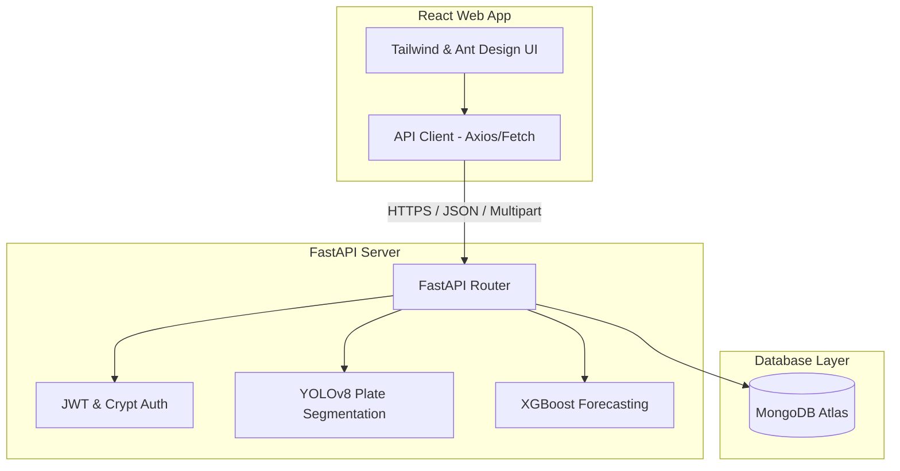

# 🍽️ VEORA Smart Restaurant Management System
### *An AI-Powered Sustainable Fine Dining Experience*

VEORA is a state-of-the-art restaurant management application integrating elegant user flows, automated reservations, inventory management, dynamic sales forecasts via XGBoost, and plate-waste tracking utilizing YOLOv8 computer vision segmentation.

---

## 🏛️ System Architecture



---

## 🚀 Getting Started (Local Development)

### 1. Prerequisites
- **Python**: v3.10+
- **Node.js**: v18+
- **MongoDB Atlas** Account or Local MongoDB

---

### 2. Backend Setup
1. Navigate to the backend directory:
   ```bash
   cd backend
   ```
2. Create and activate a python virtual environment:
   ```bash
   python -m venv venv
   # On Windows:
   .\venv\Scripts\activate
   # On macOS/Linux:
   source venv/bin/activate
   ```
3. Install dependencies:
   ```bash
   pip install -r requirements.txt
   ```
4. Copy `.env.example` to `.env` and fill in the values:
   ```bash
   # On Windows:
   copy .env.example .env
   # On macOS/Linux:
   cp .env.example .env
   ```
5. Run the FastAPI development server:
   ```bash
   python main.py
   ```
   *The api documentation will be available at `http://localhost:8000/docs`.*

---

### 3. Frontend Setup
1. Navigate to the frontend directory:
   ```bash
   cd frontend
   ```
2. Install dependencies:
   ```bash
   npm install
   ```
3. Copy `.env.example` to `.env` and fill in the values:
   ```bash
   # On Windows:
   copy .env.example .env
   # On macOS/Linux:
   cp .env.example .env
   ```
4. Run the Vite development server:
   ```bash
   npm run dev
   ```
   *The application will be live at `http://localhost:5173`.*

---

## ☁️ Production Deployment Guide

To deploy the VEORA application in a production environment, follow the steps below.

### 1. Database (MongoDB Atlas)
1. Set up a free-tier cluster on [MongoDB Atlas](https://www.mongodb.com/cloud/atlas).
2. Create a database user and record the password.
3. In Network Access, allow your deployment platform's IP addresses (or whitelist `0.0.0.0/0` temporarily).
4. Copy the connection string and set it as `MONGODB_URL` in your backend environment variables.

---

### 2. Backend (Render)
The backend is ready to run on any cloud platform supporting Python or Docker.

#### Option A: Direct Python Host (e.g., Render Web Service)
- **Runtime**: `Python 3`
- **Build Command**: `pip install -r requirements.txt`
- **Start Command**: `uvicorn main:app --host 0.0.0.0 --port $PORT`
- **Environment Variables**:
  - `MONGODB_URL`: Your Atlas connection string
  - `DATABASE_NAME`: `veora_restaurant`
  - `SECRET_KEY`: A secure random cryptographic secret
  - `ALLOWED_ORIGINS`: `https://your-frontend-domain.vercel.app` (your deployed React app URL)

#### Option B: Docker Container Deployment
Use the following `Dockerfile` in the `/backend` folder:
```dockerfile
FROM python:3.10-slim

# Install system dependencies needed for OpenCV / YOLOv8
RUN apt-get update && apt-get install -y \
    libgl1 \
    libglib2.0-0 \
    && rm -rf /var/lib/apt/lists/*

WORKDIR /app
COPY requirements.txt .
RUN pip install --no-cache-dir -r requirements.txt

COPY . .

EXPOSE 8000
CMD ["uvicorn", "main:app", "--host", "0.0.0.0", "--port", "8000"]
```

---

### 3. Frontend (Vercel)
The frontend is a static single-page React app, perfect for high-performance CDNs.

#### Deployment on Vercel:
1. Push your repository to GitHub.
2. Link your repository in [Vercel](https://vercel.com).
3. Set the **Root Directory** to `frontend`.
4. Configure the Build Settings:
   - **Build Command**: `npm run build`
   - **Output Directory**: `dist`
5. Under **Environment Variables**, add:
   - `VITE_API_URL`: `https://your-backend-service-domain.com`
6. Click **Deploy**.

---

## 🧠 Machine Learning Engine

All core machine learning assets are organized under `backend/final_model/` to separate training pipelines from active inference resources.

### 📁 Relocated ML Assets
1. **[features.pkl](file:///c:/Users/Lenovo/Desktop/PG%20Project/backend/final_model/features.pkl)**: Dynamically loaded column index defining the exact 20 feature variables used in demand forecasting.
2. **[sales_model.pkl](file:///c:/Users/Lenovo/Desktop/PG%20Project/backend/final_model/sales_model.pkl)**: Pre-trained XGBoost demand forecasting model.
3. **[yolov8m_seg_model.pt](file:///c:/Users/Lenovo/Desktop/PG%20Project/backend/final_model/yolov8m_seg_model.pt)**: Ultralytics YOLOv8 instance segmentation model weights for plate waste detection.

### 📈 Demand Forecasting (XGBoost)
The sales forecasting model predicts restaurant demand for the next 7 days based on advanced lag and rolling window metrics. It updates daily and automatically populates the `sales_forecast` and `inventory_forecast` collections in MongoDB.

#### 📊 Demand & Sales Forecast Output


### 🍕 Plate Waste Tracker (YOLOv8)
The plate waste segmentation module uses computer vision to detect plate area vs leftover food area. 
- **Under 10% Waste**: Earns **100 Points**
- **10% - 25% Waste**: Earns **50 Points**
- **25% - 50% Waste**: Earns **20 Points**
- Reaching **500 points** auto-generates a dynamic restaurant discount coupon code!

#### 📸 Plate Waste AI Analysis Examples (YOLOv8 Output Case)


---

#### 📦 Live Inventory Management & Forecasts


---

## 🔒 Security & Best Practices
- **CORS Management**: Set the `ALLOWED_ORIGINS` environment variable in production to prevent unauthorized domains from hitting your API.
- **JWT Protection**: Change the `SECRET_KEY` in production. 
- **Dynamic File Paths**: All database and model assets use dynamic runtime resolutions, ensuring perfect compatibility with both Linux (cloud) and Windows (local) environments.
